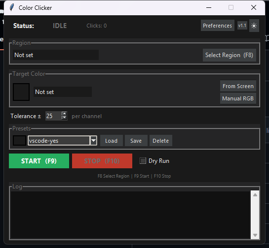

# Color Clicker

Watches a screen region for a specific color and auto-clicks its center whenever it appears. The main purpose of this is to overcome a niche problem--as of May 2026, Anthropic does not have a full 'auto' feature that allows Claude to code without prompting the user with permission questions. Github Copilot has a 'bypass approvals' feature in Visual Studio Code that allows Copilot to run without prompting the user, meaning it can be run in the background with no interruptions. However, the Claude Code extension in VScode does not have a feature like this. To overcome this, this program scans for a specific color in a specified reigon, and clicks when seen. The downside is that it steals the user's mouse, and makes the computer pretty much useless as it spawns the mouse back to the area every second. This is most useful when completely stepping away from the computer. This is perfect for vibecoders that need Claude to run when stepping away from their computer.



## Download

Grab the latest `ColorClicker.exe` from the [Releases](https://github.com/aidanlenahan/color-clicker/releases) page — no Python required. Windows will prompt for administrator rights on launch (required for global hotkeys).

## Setup (run from source)

**1. Install Python 3**

- Download and install Python 3.10+ from [python.org/downloads](https://www.python.org/downloads/)
- During installation on Windows, check **"Add Python to PATH"**
- Verify: `python --version` (should print `Python 3.x.x`)

**2. Install dependencies and run**

```bash
pip install -r requirements.txt
python main.py
```

> **Note:** Run as Administrator if hotkeys don't register globally.

## Workflow

1. **Select Region** — press **F8** or click the button, then drag a rectangle on screen (spans all monitors)
2. **Pick Color** — "From Screen" opens a live preview; hover cursor over target color and press **Enter**  
   (or use "Manual RGB" to type values directly)
3. **Adjust Tolerance** — raise the ± spinbox if the color varies slightly (default 25)
4. **Start** — press **F9** or click START; the tool clicks every time the color appears in the region
5. **Stop** — press **F10** or click STOP

## Hotkeys

| Key | Action |
|-----|--------|
| F8  | Select screen region |
| F9  | Start scanning |
| F10 | Stop scanning |

## Presets

Save the current color, tolerance, and region under a name using the **Presets** section. Load or delete presets at any time. Saved to `presets.json`.

## Preferences

Click **Preferences** in the status bar to configure:

| Setting | Default | Description |
|---------|---------|-------------|
| Scan interval | 30 ms | How fast the region is scanned (~33 FPS) |
| Consecutive frames | 1 | Frames color must appear before clicking — raise to 2–3 to ignore flickers |
| Use OpenCV | On | Contour-based center (better); off = plain pixel average |
| Click cooldown | 0.3 s | Minimum time between clicks |
| Color tolerance | 25 | Per-channel RGB tolerance (also adjustable in the main window) |
| Always on top | On | Keep the app window above other windows |
| Debug logging | On | Show clicks and errors in the log panel |

Settings are saved to `preferences.json` and applied immediately on Save.

## Tips

- **DPI scaling** is handled automatically — coordinates are correct on 125 %, 150 % displays
- **Multi-monitor** — region selection spans all monitors
- **pyautogui FAILSAFE** — move mouse to the top-left corner of the screen to immediately abort
- **Spam clicking** — if the target color stays on screen after a click, raise Click Cooldown or Consecutive Frames in Preferences
- **Game anti-cheat** software may detect or block this tool

## Build from source (compile to .exe)

PyInstaller bundles your Python script and all its dependencies into a single `.exe` that runs on any Windows machine without Python installed.

**1. Install PyInstaller**

```bash
pip install pyinstaller
```

**2. Build using the included spec file**

```bash
python -m PyInstaller color_clicker.spec
```

The spec file (`color_clicker.spec`) already has the right settings for this project — single-file output, no console window, and UAC elevation on launch (required for global hotkeys). You don't need to pass any extra flags.

The finished exe is written to `dist/ColorClicker.exe`.

**What the spec file does (for reference)**

| Setting | Value | Why |
|---|---|---|
| `--onefile` | yes | Packs everything into one `.exe` |
| `console=False` | no console window | GUI app, no terminal needed |
| `uac_admin=True` | requests admin on launch | `keyboard` library needs elevation for global hotkeys |
| hidden imports | `pystray._win32`, `mss.windows`, `PIL._tkinter_finder` | Modules PyInstaller can't auto-detect |

**To build from scratch without the spec file**

```bash
pyinstaller --onefile --noconsole --uac-admin --name ColorClicker main.py
```

> Note: the hidden imports above won't be included this way — use the spec file for a reliable build.
